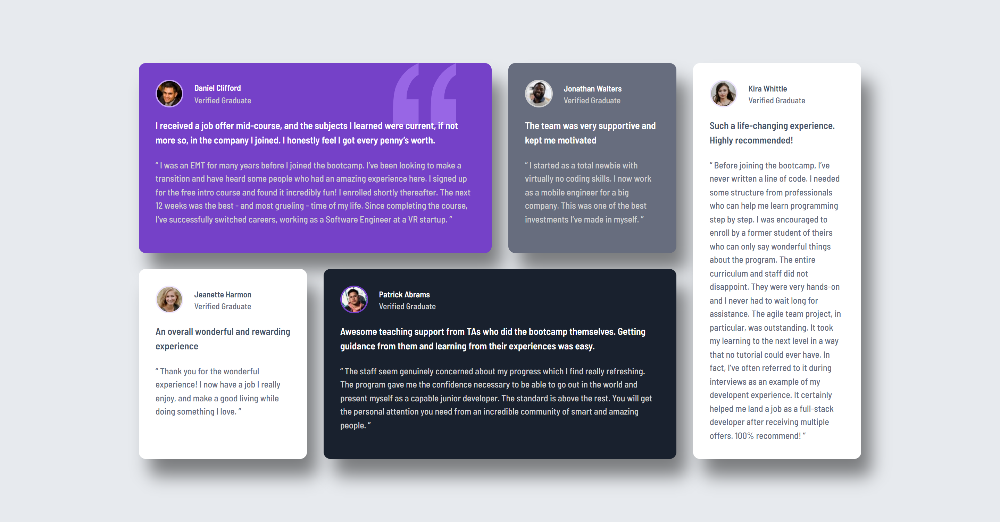
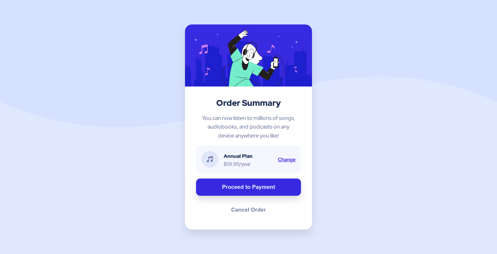
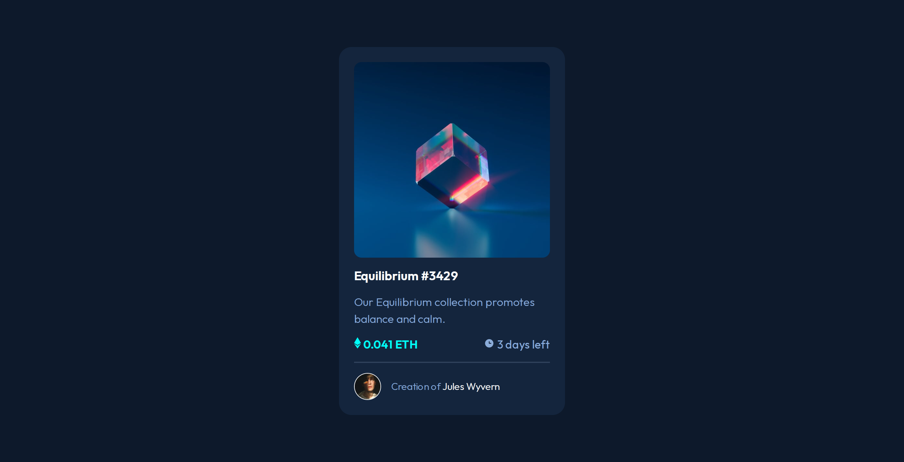
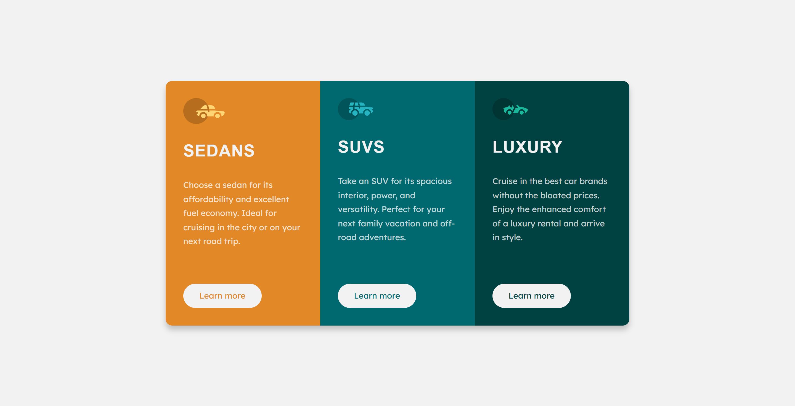
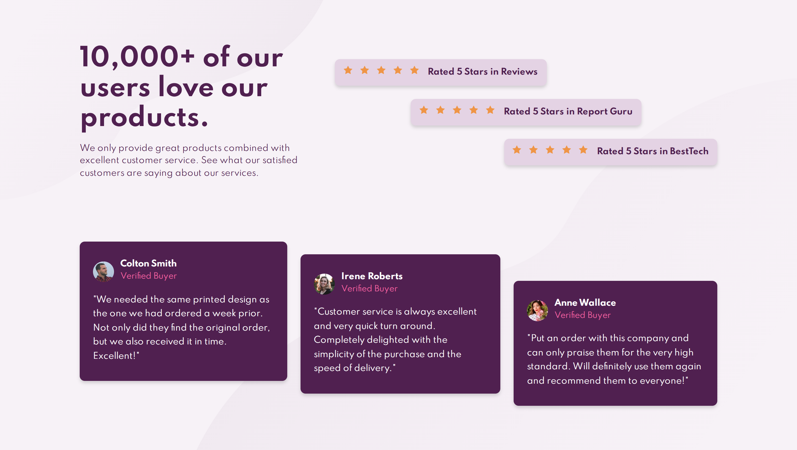

# Frontend Mentor Solutions

A collection of my solutions to Frontend Mentor challenges, built to practice and showcase modern frontend development skills.

## Table of Contents

- [Built With](#built-with)
- [Getting Started on Frontend Mentor](#getting-started-on-frontend-mentor)
- [Building Responsive Layouts](#building-responsive-layouts)
- [More Projects](#more-projects)
- [Author](#author)

### Built with

- **Semantic HTML5** for the meaningful, accessible structure.
- **Accessible markup** following best practices (ARIA, alt text, etc.).
- **CSS3** for styling and layout.
- **CSS Custom Properties** for reusable variables.
- **Utility Classes** for efficient and maintainable styling.
- **BEM methodology** for clean and scalable CSS architecture.
- **Flexbox & CSS Grid** for modern, responsive layouts.
- **Mobile-first workflow** to prioritize performance on all devices.
- **Responsive design principles** ensuring compatibility across screen sizes.

## Getting Started on Frontend Mentor

These beginner-friendly projects helped me get comfortable with the Frontend Mentor platform, working from design files, and building clean, semantic interfaces.

### QR Code Component

A simple, centered QR code component built from a Figma design file. Focused on clean structure and precise alignment using **Flexbox**.

- Live Site: [View here](https://codereme.github.io/frontend-mentor-solutions/qr-code-component/index.html)
- Code Solution: [View here](https://github.com/codereme/frontend-mentor-solutions/tree/main/qr-code-component)

### Blog Preview Card

A responsive blog card implementing custom visual styles. Features include a **box shadow** for subtle depth and controlled image cropping via container height.

- Live Site: [View here](https://codereme.github.io/frontend-mentor-solutions/blog-preview-card/index.html)
- Code Solution: [View here](https://github.com/codereme/frontend-mentor-solutions/tree/main/blog-preview-card)

### Social Links Profile

A visually appealing profile card with multiple social links. Enhanced with **smooth CSS transitions** for interactive hover effects, improving user experience.

- Live Site: [View here](https://codereme.github.io/frontend-mentor-solutions/social-links-profile/index.html)
- Code Solution: [View here](https://github.com/codereme/frontend-mentor-solutions/tree/main/social-links-profile)

### Recipe Page

A fully responsive recipe page that features **custom styled bullet lists and visually formatted tables**, enhancing readibility and user experience for cooking instructions.

- Live Site: [View here](https://codereme.github.io/frontend-mentor-solutions/recipe-page/index.html)
- Code Solution: [View here](https://github.com/codereme/frontend-mentor-solutions/tree/main/recipe-page)

## Building Responsive Layouts

These projects focus on mastering complex, responsive layouts. Each challenge was built with a **mobile-first approach**, utilizing **CSS Grid** and **Flexbox** to create fluid, adaptive designs that work seamlessly across all devices.

### Product Preview Card Component

A responsive product card implementing modern CSS techniques. Features include **dynamic typography** using clamp() function and **adaptive images** using the `<picture>` element with `srcset` for optimal performance.

- Live Site: [View here](https://codereme.github.io/frontend-mentor-solutions/product-preview-card/index.html)
- Code Solution: [View here](https://github.com/codereme/frontend-mentor-solutions/tree/main/product-preview-card)

### Four Card Feature Section

A responsive layout built with **CSS GRID** to arrange feature cards. Each card includes a **stylish top border accent** created with a `::before` pseudo-element.

- Live Site: [View here](https://codereme.github.io/frontend-mentor-solutions/four-card-feature-section/index.html)
- Code Solution: [View here](https://github.com/codereme/frontend-mentor-solutions/tree/main/four-card-feature-section)

### Testimonials Grid Section

A multi-column testimonial section constructed with **CSS Grid**. Focused on creating a balanced and visually appealing card layout with customized styling.

- Live Site: [View here](https://codereme.github.io/frontend-mentor-solutions/testimonials-grid-section/index.html)
- Code Solution: [View here](https://github.com/codereme/frontend-mentor-solutions/tree/main/testimonials-grid-section)

## More Projects

A diverse collection of components and landing pages that further practice care frontend concepts.

### Profile Card Component

A centered profile card component. Practiced positioning the avatar image using CSS `transform: translate()` and managing background images for layout depth.

- Live Site: [View here](https://codereme.github.io/frontend-mentor-solutions/profile-card-component/index.html)
- Code Solution: [View here](https://github.com/codereme/frontend-mentor-solutions/tree/main/profile-card-component)

### Order Summary Component

A clean order summary component built with **accessibility in mind**. Includes proper **ARIA labels** and a technique for **visually hiding decorative icons** while keeping them accessible to screen readers.

- Live Site: [View here](https://codereme.github.io/frontend-mentor-solutions/order-summary-component/index.html)
- Code Solution: [View here](https://github.com/codereme/frontend-mentor-solutions/tree/main/order-summary-component)

### NFT Preview Card Component

A preview card for an NFT asset. Features a **smooth image overlay effect** on hover, achieved with CSS transitions and absolute positioning.

- Live Site: [View here](https://codereme.github.io/frontend-mentor-solutions/nft-preview-card-component/index.html)
- Code Solution: [View here](https://github.com/codereme/frontend-mentor-solutions/tree/main/nft-preview-card-component)

### Stats Preview Card Component

A card component showcasing statistics. The key feature is a **color overlay on the main image**, created using a `::before` pseudo-element with a semi-transparent background.

- Live Site: [View here](https://codereme.github.io/frontend-mentor-solutions/stats-preview-card-component/index.html)
- Code Solution: [View here](https://github.com/codereme/frontend-mentor-solutions/tree/main/stats-preview-card-component)

### 3 Column Preview Card

A three-column feature card. Focused on **custom styling for each section** and implemented using the **BEM methodology** for clean, maintainable CSS.

- Live Site: [View here](https://codereme.github.io/frontend-mentor-solutions/3-column-preview-card/index.html)
- Code Solution: [View here](https://github.com/codereme/frontend-mentor-solutions/tree/main/3-column-preview-card)

### Huddle Landing Page

A responsive landing page with **conditional background images** for mobile and desktop. Also features efficient **social media icons** implemented using an **SVG sprite sheet**.

- Live Site: [View here](https://codereme.github.io/frontend-mentor-solutions/huddle-landing-page/index.html)
- Code Solution: [View here](https://github.com/codereme/frontend-mentor-solutions/tree/main/huddle-landing-page)

### Social Proof Section

A responsive social proof section built to display testimonials and ratings in a clean, structured layout.

- Live Site: [View here](https://codereme.github.io/frontend-mentor-solutions/social-proof-section/index.html)
- Code Solution: [View here](https://github.com/codereme/frontend-mentor-solutions/tree/main/social-proof-section)

### Single Price Grid Component

A pricing component with a multi-layered grid layout, emphasizing visual hierarchy and clear call-to-action sections.

- Live Site: [View here](https://codereme.github.io/frontend-mentor-solutions/single-price-grid-component/index.html)
- Code Solution: [View here](https://github.com/codereme/frontend-mentor-solutions/tree/main/single-price-grid-component)

## Author

- Frontend Mentor - [@codereme](https://www.frontendmentor.io/profile/codereme)
- Github - [@codereme](https://github.com/codereme)
