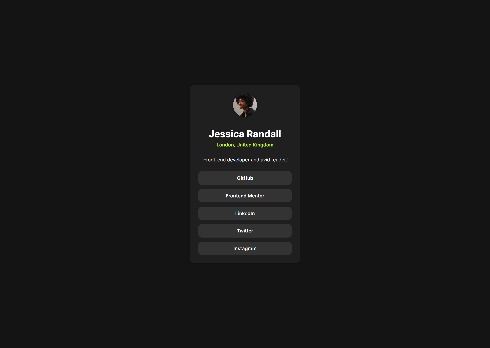
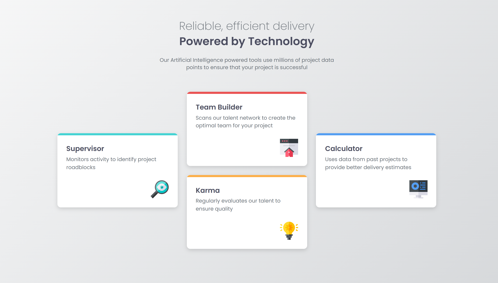
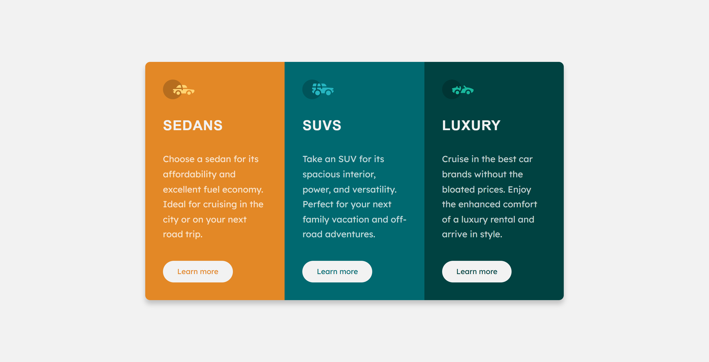
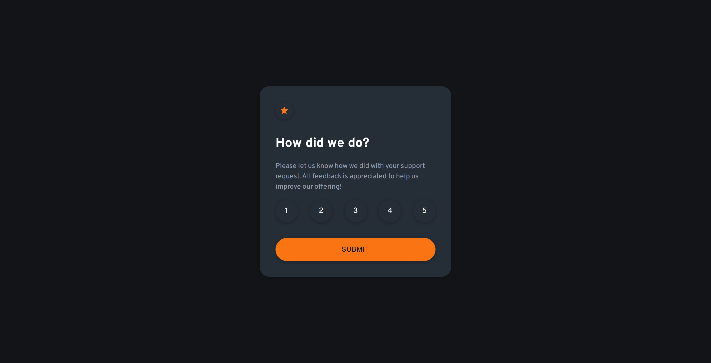
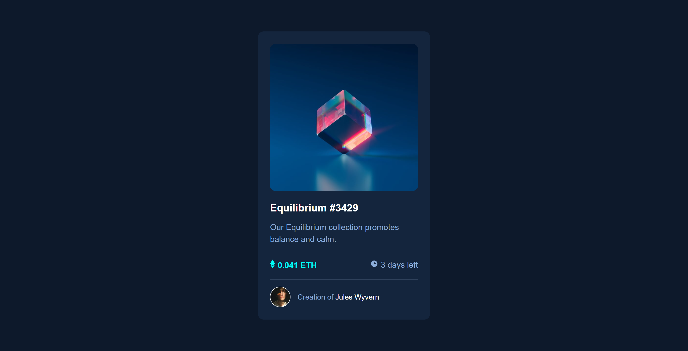
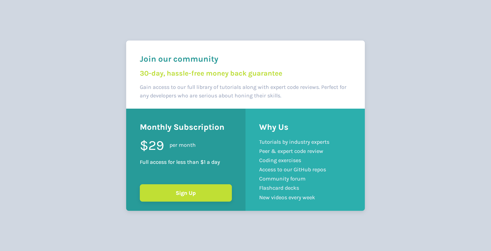

# Frontend Mentor Solutions

#### QR Code Component

<a href="https://codereme.github.io/frontend-mentor-solutions/qr-code-component/index.html">Demo</a> |
<a href="https://codereme.github.io/frontend-mentor-solutions/tree/main/qr-code-component">Code</a>

#### Blog Preview Card

<a href="https://codereme.github.io/frontend-mentor-solutions/blog-preview-card/index.html">Demo</a> |
<a href="https://codereme.github.io/frontend-mentor-solutions/tree/main/blog-preview-card">Code</a>

#### Social Links Profile

<a href="https://codereme.github.io/frontend-mentor-solutions/social-links-profile/index.html">Demo</a> |
<a href="https://codereme.github.io/frontend-mentor-solutions/tree/main/social-links-profile">Code</a>

#### Recipe Page

<a href="https://codereme.github.io/frontend-mentor-solutions/recipe-page/index.html">Demo</a> |
<a href="https://codereme.github.io/frontend-mentor-solutions/tree/main/recipe-page">Code</a>

#### Product Preview Card Component

<a href="https://codereme.github.io/frontend-mentor-solutions/product-preview-card/index.html">Demo</a> |
<a href="https://codereme.github.io/frontend-mentor-solutions/tree/main/product-preview-card">Code</a>

#### Four Card Feature Section

<a href="https://codereme.github.io/frontend-mentor-solutions/four-card-feature-section/index.html">Demo</a> |
<a href="https://codereme.github.io/frontend-mentor-solutions/tree/main/four-card-feature-section">Code</a>

#### Testimonials Grid Section

<a href="https://codereme.github.io/frontend-mentor-solutions/testimonials-grid-section/index.html">Demo</a> |
<a href="https://codereme.github.io/frontend-mentor-solutions/tree/main/testimonials-grid-section">Code</a>

#### 3 Column Preview Card

<a href="https://codereme.github.io/frontend-mentor-solutions/3-column-preview-card/index.html">Demo</a> |
<a href="https://codereme.github.io/frontend-mentor-solutions/tree/main/3-column-preview-card">Code</a>

#### Huddle Landing Page

<a href="https://codereme.github.io/frontend-mentor-solutions/huddle-landing-page/index.html">Demo</a> |
<a href="https://codereme.github.io/frontend-mentor-solutions/tree/main/huddle-landing-page">Code</a>

#### Interactive Rating Component

<a href="https://codereme.github.io/frontend-mentor-solutions/interactive-rating-component/index.html">Demo</a> |
<a href="https://codereme.github.io/frontend-mentor-solutions/tree/main/interactive-rating-component">Code</a>

#### NFT Preview Card Component

<a href="https://codereme.github.io/frontend-mentor-solutions/nft-preview-card-component/index.html">Demo</a> |
<a href="https://codereme.github.io/frontend-mentor-solutions/tree/main/nft-preview-card-component">Code</a>

#### Order Summary Component

<a href="https://codereme.github.io/frontend-mentor-solutions/order-summary-component/index.html">Demo</a> |
<a href="https://codereme.github.io/frontend-mentor-solutions/tree/main/order-summary-component">Code</a>

#### Ping Coming Soon Page

<a href="https://codereme.github.io/frontend-mentor-solutions/ping-coming-soon-page/index.html">Demo</a> |
<a href="https://codereme.github.io/frontend-mentor-solutions/tree/main/ping-coming-soon-page">Code</a>

#### Profile Card Component

<a href="https://codereme.github.io/frontend-mentor-solutions/profile-card-component/index.html">Demo</a> |
<a href="https://codereme.github.io/frontend-mentor-solutions/tree/main/profile-card-component">Code</a>

#### Single Price Grid Component

<a href="https://codereme.github.io/frontend-mentor-solutions/single-price-grid-component/index.html">Demo</a> |
<a href="https://codereme.github.io/frontend-mentor-solutions/tree/main/single-price-grid-component">Code</a>

#### Social Proof Section

<a href="https://codereme.github.io/frontend-mentor-solutions/social-proof-section/index.html">Demo</a> |
<a href="https://codereme.github.io/frontend-mentor-solutions/tree/main/social-proof-section">Code</a>

#### Stats Preview Card Component

<a href="https://codereme.github.io/frontend-mentor-solutions/stats-preview-card-component/index.html">Demo</a> |
<a href="https://codereme.github.io/frontend-mentor-solutions/tree/main/stats-preview-card-component">Code</a>

