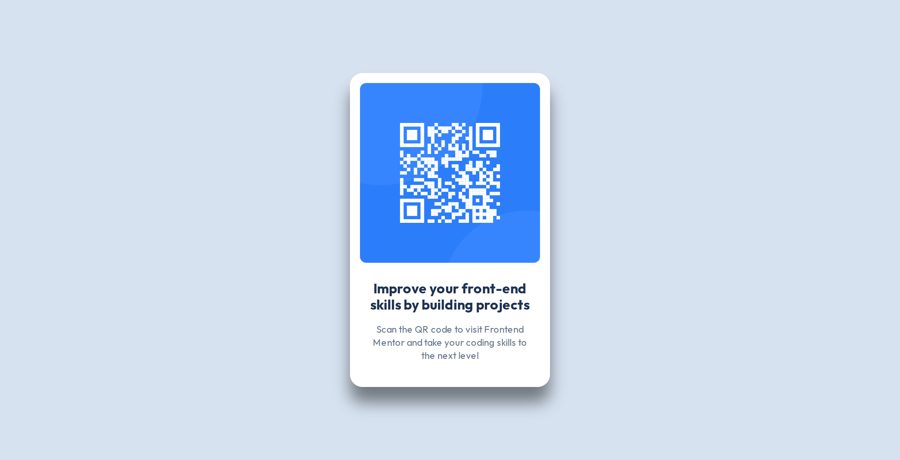
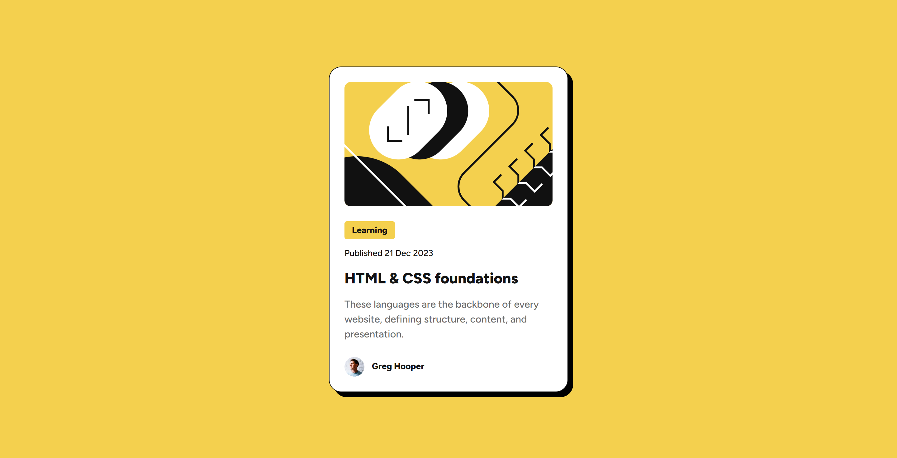
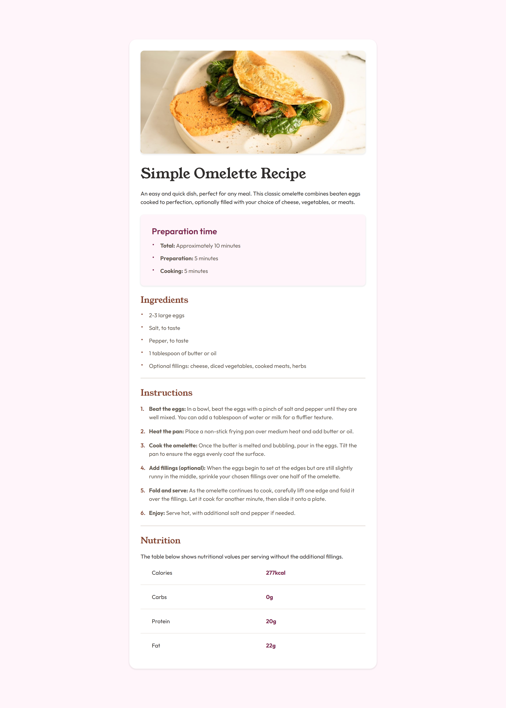

# Frontend Mentor Solutions

Solutions to Frontend Mentor learning paths and other challenges.

## Table of Content

- [Built With](#built-with)
- [Getting Started on Frontend Mentor](#getting-started-on-frontend-mentor)
- [Building Responsive Layouts](#building-responsive-layouts)
- [More Projects](#more-projects)
- [Author](#author)

### Built with

- Semantic HTML5 for the structure
- Accessible markup
- CSS for the styling
- Custom properties
- Utility Classes
- BEM methodology
- Flexbox
- CSS Grid
- Mobile-first workflow
- Responsive design principles

## Getting Started on Frontend Mentor

These projects will help you find your feet on the Frontend Mentor platform and give you experience working with designs and building small projects.

### QR Code Component

Built following the Figma design system. Centered component using Flexbox.

<a href="https://codereme.github.io/frontend-mentor-solutions/qr-code-component/index.html">View live site</a>

<a href="https://github.com/codereme/frontend-mentor-solutions/tree/main/qr-code-component">Go to code solution</a>

### Blog Preview Card

Built following the Figma design system. Card with `custom border styling` using box-shadow, with cropping image using the `height` of the image container.

<a href="https://codereme.github.io/frontend-mentor-solutions/blog-preview-card/index.html">View live site</a>

<a href="https://github.com/codereme/frontend-mentor-solutions/tree/main/blog-preview-card">Go to code solution</a>

### Social Links Profile

Beautiful social links profile card with `smooth interactive transitions`.

<a href="https://codereme.github.io/frontend-mentor-solutions/social-links-profile/index.html">View live site</a>

<a href="https://github.com/codereme/frontend-mentor-solutions/tree/main/social-links-profile">Go to code solution</a>

### Recipe Page

Responsive recipe page with `custom bullet lists` and `table styling`.

<a href="https://codereme.github.io/frontend-mentor-solutions/recipe-page/index.html">View live site</a>

<a href="https://github.com/codereme/frontend-mentor-solutions/tree/main/recipe-page">Go to code solution</a>

## Building Responsive Layouts

The challenges in this path are designed to help you get to grips with making layouts that work across all devices.

### Product Preview Card Component

Featuring responsive typography using `clamp()` and responsive images using `<picture>` with srcset.

<a href="https://codereme.github.io/frontend-mentor-solutions/product-preview-card/index.html">View live site</a>

<a href="https://github.com/codereme/frontend-mentor-solutions/tree/main/product-preview-card">Go to code solution</a>

### Four Card Feature Section

Responsive css grid section. Stylish top border card using pseudoelement.

<a href="https://codereme.github.io/frontend-mentor-solutions/four-card-feature-section/index.html">View live site</a> |
<a href="https://github.com/codereme/frontend-mentor-solutions/tree/main/four-card-feature-section">Go to code solution</a>

<!-- 
 -->

### Testimonials Grid Section

CSS Grid section with customized cards.

<a href="https://codereme.github.io/frontend-mentor-solutions/testimonials-grid-section/index.html">View live site</a> |
<a href="https://github.com/codereme/frontend-mentor-solutions/tree/main/testimonials-grid-section">Go to code solution</a>

<!-- 
 -->

## More Projects

### Profile Card Component

Use of background image. Avatar positioned using translate transform.

<a href="https://codereme.github.io/frontend-mentor-solutions/profile-card-component/index.html">View live site</a> |
<a href="https://github.com/codereme/frontend-mentor-solutions/tree/main/profile-card-component">Go to code solution</a>

<!-- 
 -->

### Order Summary Component

Component buitl with accessible markup using aria labels and hidden icon.

<a href="https://codereme.github.io/frontend-mentor-solutions/order-summary-component/index.html">View live site</a> |
<a href="https://github.com/codereme/frontend-mentor-solutions/tree/main/order-summary-component">Go to code solution</a>

<!-- 
 -->

### NFT Preview Card Component

Component with overlay image hover effect.

<a href="https://codereme.github.io/frontend-mentor-solutions/nft-preview-card-component/index.html">View live site</a> |
<a href="https://github.com/codereme/frontend-mentor-solutions/tree/main/nft-preview-card-component">Go to code solution</a>

<!-- 
 -->

### Stats Preview Card Component

Use of pseudoelement to create the averlay image purple background.

<a href="https://codereme.github.io/frontend-mentor-solutions/stats-preview-card-component/index.html">View live site</a> |
<a href="https://github.com/codereme/frontend-mentor-solutions/tree/main/stats-preview-card-component">Go to code solution</a>

<!-- 
 -->

### 3 Column Preview Card

Component with customized sections. Use of BEM methodology.

<a href="https://codereme.github.io/frontend-mentor-solutions/3-column-preview-card/index.html">View live site</a> |
<a href="https://github.com/codereme/frontend-mentor-solutions/tree/main/3-column-preview-card">Go to code solution</a>

<!-- 

 -->

### Huddle Landing Page

Social icon links using `SVG sprite`. Background images for mobile and desktop screens.

<a href="https://codereme.github.io/frontend-mentor-solutions/huddle-landing-page/index.html">View live site</a> |
<a href="https://github.com/codereme/frontend-mentor-solutions/tree/main/huddle-landing-page">Go to code solution</a>

<!-- 

 -->

### Social Proof Section

<a href="https://codereme.github.io/frontend-mentor-solutions/social-proof-section/index.html">View live site</a> |
<a href="https://github.com/codereme/frontend-mentor-solutions/tree/main/social-proof-section">Go to code solution</a>

<!-- 
 -->

### Single Price Grid Component

<a href="https://codereme.github.io/frontend-mentor-solutions/single-price-grid-component/index.html">View live site</a> |
<a href="https://github.com/codereme/frontend-mentor-solutions/tree/main/single-price-grid-component">Go to code solution</a>

<!-- 
 -->

## Author

- Frontend Mentor - [@codereme](https://www.frontendmentor.io/profile/codereme)
- Github - [@codereme](https://github.com/codereme)
