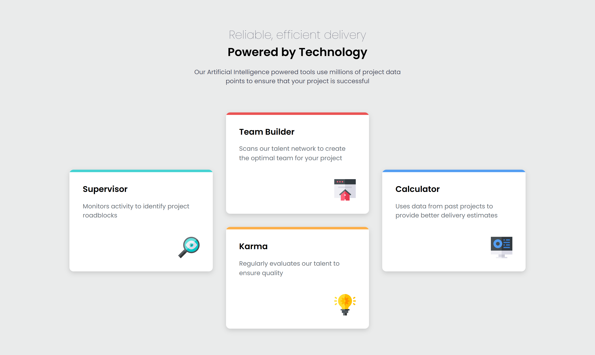

# Four Card Feature Section

This is a solution to the [Four card feature section challenge on Frontend Mentor](https://www.frontendmentor.io/challenges/four-card-feature-section-weK1eFYK). Frontend Mentor challenges help you improve your coding skills by building realistic projects.

## The challenge

Users should be able to:

- View the optimal layout for the site depending on their device's screen size

## Screenshot



## Built with

- Semantic HTML5 markup
- CSS custom properties
- Flexbox
- CSS Grid
- Mobile-first workflow

## What I Learned

- **CSS Pseudo-elements**: Used `::before` to create stylish top borders for each card.

```css
.card::before {
  content: "";
  position: absolute;
  inset-block-start: 0;
  inset-inline-start: 0;
  inline-size: 100%;
  block-size: 0.4rem;
}
.card--supervisor::before {
  background-color: var(--cyan);
}
.card--builder::before {
  background-color: var(--red);
}
.card--karma::before {
  background-color: var(--orange);
}
.card--calculator::before {
  background-color: var(--blue);
}
```

## Links

- Solution URL: [https://www.frontendmentor.io/solutions/responsive-grid-four-card-section-jxW9iEQ8zZ](https://www.frontendmentor.io/solutions/responsive-grid-four-card-section-jxW9iEQ8zZ)

- Live Site URL: [https://codereme.github.io/frontend-mentor-solutions/four-card-feature-section/index.html](https://codereme.github.io/frontend-mentor-solutions/four-card-feature-section/index.html)

## Author

- Frontend Mentor - [@codereme](https://www.frontendmentor.io/profile/codereme)
- Github - [@codereme](https://github.com/codereme)
